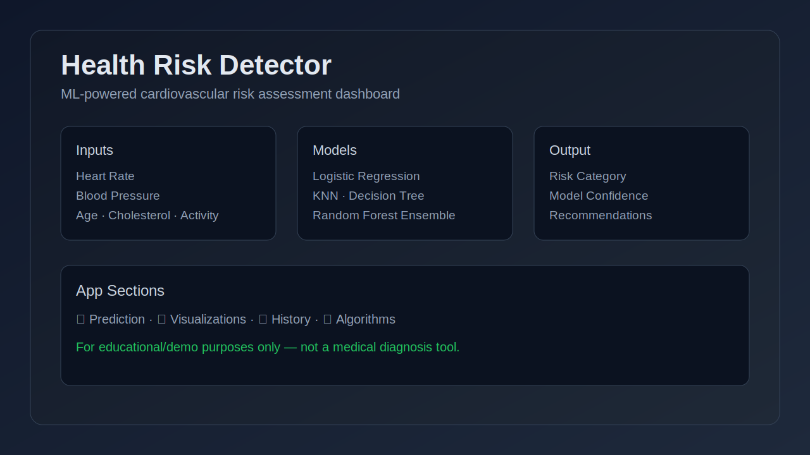

# Health Risk Detector

Health Risk Detector is a browser-based demo app for cardiovascular risk assessment using an ensemble of ML-inspired models.

## Features
- Interactive health metric inputs (heart rate, blood pressure, age, cholesterol, activity, smoking)
- Ensemble-style risk scoring across 4 models
- Visualizations, model comparison, and decision-boundary demo
- Prediction history and educational algorithm notes

## Run locally
This project is static HTML/CSS/JS.

1. Open `/home/runner/work/health_risk_detector/health_risk_detector/index.html` in your browser.
2. Use the tabs to explore Prediction, Visualizations, History, and Algorithms.
